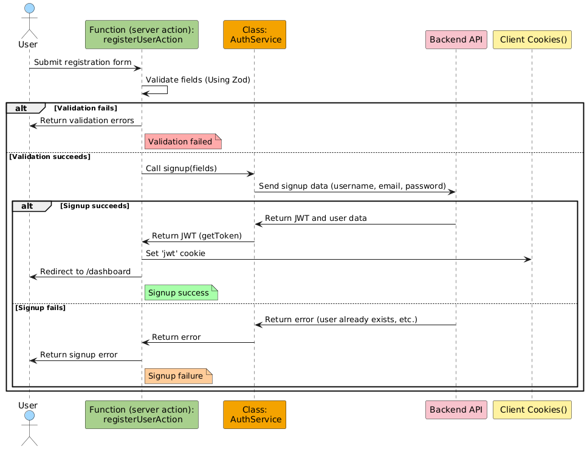
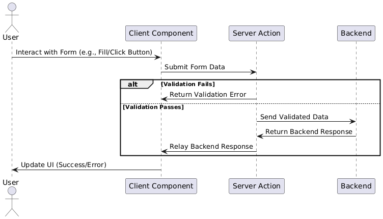
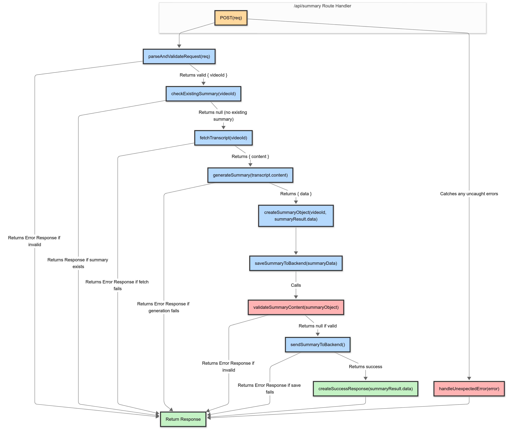

# That Summarizer ( frontend )
## About the Project
**That Summarizer** : A modern and intuitive web application designed to make summarizing YouTube videos effortless. Simply input a video URL to generate concise, easy-to-read summaries. Enhance your experience by adding personal notes and saving them to your account for seamless access anytime.

-This project is built using:

 - **Frontend** : TypeScript and Next.js for a dynamic and responsive user interface.
 - **Backend** : Strapi for efficient and scalable content management.You can find the backend repository [here](<https://github.com/Ramzi-Hadrouk/ThatSummarizer-backend>)


---

## Table of Contents
1. [Features](#features)
2. [Architecture & Diagrams](#architecture--diagrams)
3. [Tech Stack](#tech-stack)
4. [Getting Started](#getting-started)
   - [Prerequisites](#prerequisites)
   - [Installation](#installation)
   - [Environment Variables](#environment-variables)
   - [Running the App](#running-the-app)
5. [Usage](#usage)
6. [Contributing](#contributing)
7. [License](#license)
8. [Contact](#contact)

---

## Features
- **User Authentication**: JWT-based auth with HTTP-only cookies for secure sessions.  
- **YouTube Summarization**: Seamless integration with Gemini for powerful, AI-driven video summaries.  
- **Notes & WYSIWYG Editor**: Rich-text editing powered by React Quill, giving users a Word-like experience.  
- **Print Summary**: Easily print or save a physical copy of your summary directly from the app.  
- **Customizable Layout**: Drag-and-drop component positioning configurable via the Strapi dashboard.  
- **Server-side Validation**: Robust data validation for all user inputs at the API level.  
- **Responsive Design**: Mobile-first layout ensuring a smooth experience on all device sizes.

---

## Architecture & Diagrams

### 1. Full Authentication Process Flow


### 3. Server-side Action Validation


### 1. Summarization Route Handler Flow



---

## Tech Stack
| Layer               | Technology           |
|---------------------|----------------------|
| Frontend Framework  | Next.js              |
| Backend CMS/API     | Strapi               |
| Auth                | JSON Web Tokens, HTTP-only Cookies |
| Editor              | React Quill          |
| Summarization AI    | Gemini API           |
| Styling             | Tailwind CSS         |
| Database            | SQLite (default) or PostgreSQL (option) |


---

## Getting Started

### Prerequisites
- Node.js v18+  
- npm or yarn  
- Strapi CLI (for local CMS development)

### Installation
1. **Clone the repository**
   ```bash
   git clone https://github.com/yourusername/that-summarizer.git
   cd that-summarizer
   ```

2. **Install dependencies**
   - Frontend
     ```bash
     cd frontend
     npm install
     ```
   - Backend (Strapi)
     ```bash
     cd ../backend
     npm install
     ```

### Environment Variables
- Create a `.env.local` file in `frontend/`:
  ```ini
  NODE_ENV=development
  BASE_URL=http://localhost:1337
  DEEPSEEK_API_KEY=<your_jwt_secret>
  GEMINI_API_KEY=<your_gemini_api_key> 
  ```

### Running the App
1. **Start Strapi** (in `backend/`)
   ```bash
   npm run develop
   ```

2. **Start Next.js** (in `frontend/`)
   ```bash
   npm run dev
   ```

Visit `http://localhost:3000` to explore **That Summarizer**.

---
## Usage
1. **Register** or **Log in** with your email and password.  
2. **Paste a YouTube URL** into the Summarizer input.  
3. **Generate a Summary** using Gemini’s AI.  
4. **Take Notes** in the WYSIWYG editor; format text, add lists, and more.  
5. **Save** your summary and notes; access them anytime in your dashboard.  
6. **Print** your summary directly via the app’s print button or your browser’s print dialog.  

---


---

## Contributing
Contributions are welcome! Please open an issue or submit a pull request with clear descriptions of your changes.

---

## License
This project is licensed under the MIT License. See [LICENSE](LICENSE) for details.

---

## Contact
Created by **Ramzi Hadrouk**.  
Follow me on
 [GitHub](https://github.com/yourusername) for more projects and updates.
```


 
